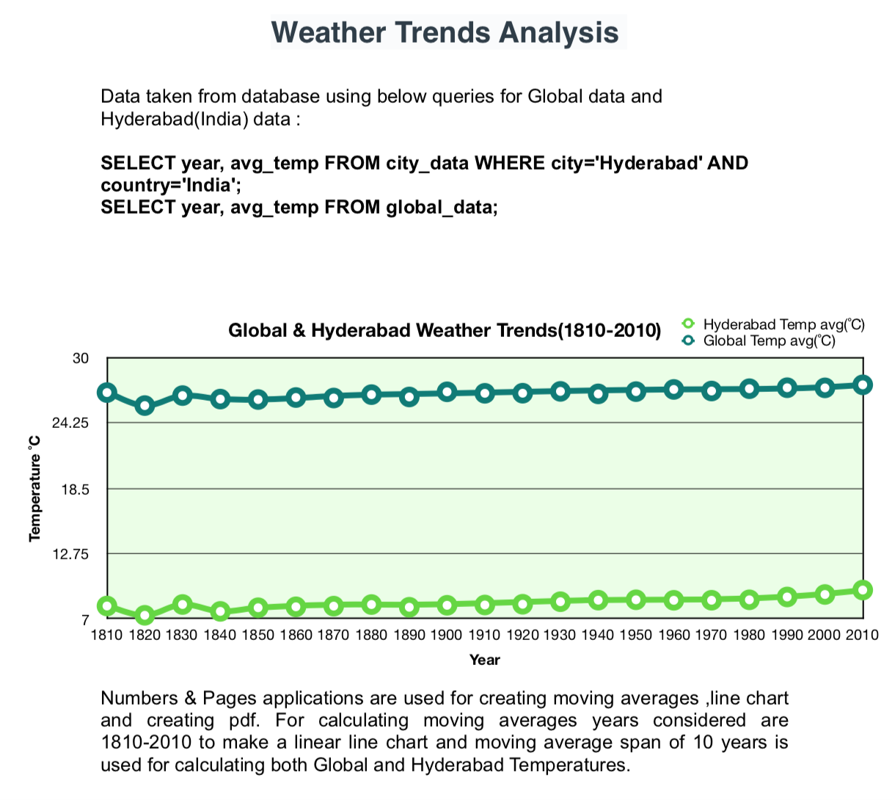

# Exploring Weather Trends

### Summary
  In this project, local and global temperature data are taken and using moving averages, observations are made about similarities and differences between global temperature trends and Hyderabad temperature trends.

### Prerequisite
  * Need to know Basic SQL queries to pull data from Database
  * Should be able to edit and modify csv data using any spreadsheet applications like Numbers(Mac) or MS Excel(windows)

### Step-by-Step Instructions
   * Open Global.csv and Hyderabad.csv files using Numbers application
   * Create a new column moving averages in both Tables
   * Calculate moving average to smooth out data
   * Make sure both Tables are in same data range
   * Create Line chart from Table data for both Tables
   * Compare both line charts and make observations

### Report

  

#### Following Observations are found after analyzing chart data:
* Main similarities between Global data and Hyderabad data are both observed lowest temperature around 1820.
* Highest temperature is observed in 2010 for both Global and Hyderabad .

* Global temperature is on rise from 1960 onwards whereas Hyderabad temperature is on rise from 2000.
* Global temperature has increased by 17.22% from 1810 to 2010 

* Hyderabad temperature increased by 2.52% from 1810 to 2010 

* Global temperature rise is 6 times more than Hyderabad temperature rise. 

* Global and Hyderabad Data suggests that 2020 average temperature is going 
to be more than 2010 . 

* Below Formula is used for calculating increase in temperature : 
   

       ((2010 Temp -1810 Temp)/1810 Temp)*100


 ** where 2010 Temp is Temperature in year 2010 and 1810 Temp is Temperature in year 1810 

* Global temperature rise may be due to many reasons like melting of polar 
regions, increase in carbon footprint ,exploiting natural resources etc.
* In Hyderabad the main reason for temperature rise may be due to 
industrialization . It increased the usage of fuel both for industrial and non- industrial purposes and caused ecological imbalance which resulted in increase of temperature

### Built with
* [Numbers](https://www.apple.com/in/numbers/)
